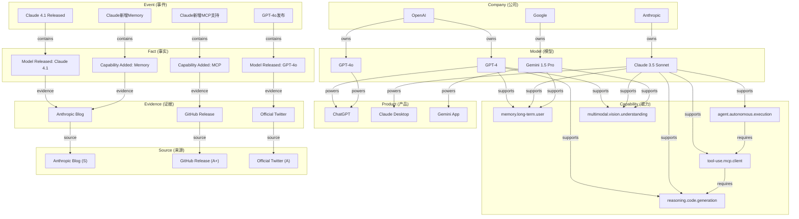
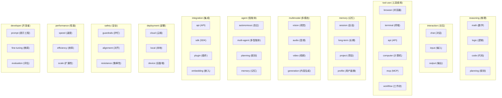
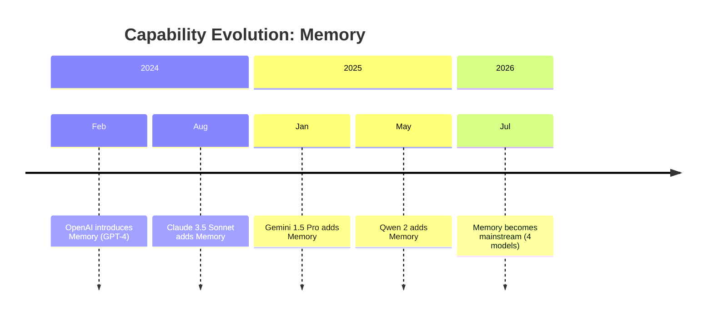

# AI Knowledge Graph Specification（AKG）

> 版本：v1.0 | 创建日期：2026-07-06 | 更新频率：每月 Review

> 参考：[002-AIS.md](002-AIS.md)

---

## 设计原则（Design Principles）

参考 [001-Vision.md](001-Vision.md) 中的设计原则章节。

---

## 核心概念

### Capability First

**Capability 是知识图谱的核心节点。**

不是 Event，不是 Article，不是 News。

所有查询、所有分析、所有回答，都以 Capability 为中心。

---

## 节点（Node）

### 核心节点类型

| Node Type | 中文 | 定义 | 关键字段 |
|-----------|------|------|---------|
| **Capability** | 能力 | AI 系统具备的具体能力 | code, name_en, name_zh, domain, category, definition, first_seen_at |
| **Model** | 模型 | AI 模型 | name, company, capabilities[], status, first_seen_at |
| **Product** | 产品 | AI 产品/应用 | name, company, models[], capabilities[], status, first_seen_at |
| **Company** | 公司 | AI 公司/组织 | name, products[], models[], capabilities[] |
| **Fact** | 事实 | 单个事实（原子单位） | type, subject, capability, value, evidence[], confidence |
| **Event** | 事件 | 由多个事实组成的事件 | type, title, facts[], capabilities[], score, confidence, status |
| **Evidence** | 证据 | 支撑事实的来源 | source, url, extracted_claim, is_official, confidence |
| **Source** | 来源 | 信息来源 | name, tier, credibility, type |

---

## 关系（Relationship）

### 核心关系类型

| Relation | 中文 | 定义 | 方向 | 示例 |
|----------|------|------|------|------|
| **supports** | 支持 | 模型/产品支持某种能力 | Model/Product → Capability | Claude supports Memory |
| **belongs_to** | 属于 | 子实体属于父实体 | Model/Product → Company | GPT-4 belongs_to OpenAI |
| **powers** | 驱动 | 模型驱动产品 | Model → Product | GPT-4 powers ChatGPT |
| **requires** | 依赖 | 能力依赖另一种能力 | Capability → Capability | MCP Client requires Tool Use |
| **competes_with** | 竞争 | 实体竞争关系 | Model/Product → Model/Product | Claude competes_with GPT-4 |
| **implements** | 实现 | 产品实现协议 | Product → Protocol | Claude Desktop implements MCP |
| **evaluated_by** | 被评测 | 模型被基准评测 | Model → Benchmark | GPT-4 evaluated_by MMLU |
| **predecessor_of** | 前身 | 版本演进 | Model → Model | GPT-4 predecessor_of GPT-4o |
| **contains** | 包含 | 事件包含事实 | Event → Fact | Event contains Fact |
| **supports_with** | 支持于 | 模型/产品在某个时间支持能力 | Model/Product → Capability | 带时间戳的支持关系 |
| **evolved_from** | 演化自 | 能力演化关系 | Capability → Capability | Memory evolved_from Session Context |

---

## 约束（Constraint）

### 节点约束

| 节点 | 约束 |
|------|------|
| Capability | code 唯一，不允许重复定义 |
| Model | name + company 唯一 |
| Product | name + company 唯一 |
| Company | name 唯一 |
| Event | 至少包含 1 个 Fact |
| Fact | 必须关联至少 1 个 Evidence |
| Evidence | 必须关联 1 个 Source |

### 关系约束

| 关系 | 约束 |
|------|------|
| supports | 同一 Model/Product 同一 Capability 只能有一条记录（但可以有时间范围） |
| belongs_to | 一个 Model 只能属于一个 Company（开源例外） |
| powers | 一个 Product 可以被多个 Model 驱动 |
| contains | 一个 Event 可以包含多个 Fact |

### 时间约束

| 约束 | 说明 |
|------|------|
| Fact.detected_at | 必须有时间戳 |
| Event.detected_at | 必须有时间戳 |
| Capability.first_seen_at | 必须有时间戳（可从首个支持的 Event 推导） |
| supports_with.from | 能力开始支持的时间 |
| supports_with.to | 能力停止支持的时间（可选） |

---

## 知识图谱 Mermaid 图

### 核心图谱结构



### Capability 分类树



### 能力演化图



---

## 查询模式（Query Patterns）

### Pattern 1: Capability Lookup

**问题**：哪些模型支持 X 能力？

**查询**：
```
MATCH (m:Model)-[:supports]->(c:Capability {code: "memory.long-term.user"})
RETURN m.name, c.name_zh
```

### Pattern 2: Model Comparison

**问题**：X 和 Y 模型的能力差异？

**查询**：
```
MATCH (m1:Model {name: "GPT-4"})-[:supports]->(c1:Capability)
MATCH (m2:Model {name: "Claude 3.5 Sonnet"})-[:supports]->(c2:Capability)
RETURN c1.code, c1.name_zh, 
       CASE WHEN c1.code IN c2.code THEN "Both" ELSE "GPT-4 Only" END as status
```

### Pattern 3: Evolution Timeline

**问题**：X 能力的演化时间线？

**查询**：
```
MATCH (c:Capability {code: "memory.long-term.user"})
MATCH (m:Model)-[s:supports_with]->(c)
RETURN m.name, s.from, s.to
ORDER BY s.from
```

### Pattern 4: Activity Ranking

**问题**：哪个模型最近更新最频繁？

**查询**：
```
MATCH (m:Model)<-[:acts_on]-(e:Event)
WHERE e.detected_at > datetime("now") - duration({days: 90})
RETURN m.name, COUNT(e) as update_count
ORDER BY update_count DESC
LIMIT 10
```

### Pattern 5: Trend Analysis

**问题**：最近最热门的能力是什么？

**查询**：
```
MATCH (e:Event)-[:changes]->(c:Capability)
WHERE e.detected_at > datetime("now") - duration({days: 90})
RETURN c.code, c.name_zh, COUNT(e) as event_count
ORDER BY event_count DESC
LIMIT 10
```

---

## 数据更新流程

```
Collect → Normalize → Extract Fact → Validate → Correlate → Build Event → Update Capability → Update Knowledge Graph
```

### 各阶段对图谱的影响

| 阶段 | 图谱变化 |
|------|---------|
| **Collect** | 无变化 |
| **Normalize** | 无变化 |
| **Extract Fact** | 新增 Fact 节点，关联 Evidence |
| **Validate** | 更新 Fact.confidence |
| **Correlate** | 建立 Fact 与现有 Event 的关联 |
| **Build Event** | 新增 Event 节点，关联 Fact |
| **Update Capability** | 更新 Capability.supports 关系 |
| **Update Knowledge Graph** | 更新所有相关节点和关系 |

---

## 版本管理

### 图谱版本

```
{major}.{minor}.{patch}
```

- 新增节点类型：major +1
- 新增关系类型：minor +1
- 修改节点属性：patch +1

### 数据版本

所有节点和关系都有版本号：
```
node.version: Integer
relation.version: Integer
```

更新时版本号 +1，历史版本保留。

---

*文档版本：v1.0*
*创建日期：2026-07-06*
*下次 Review：2026-08-06*
