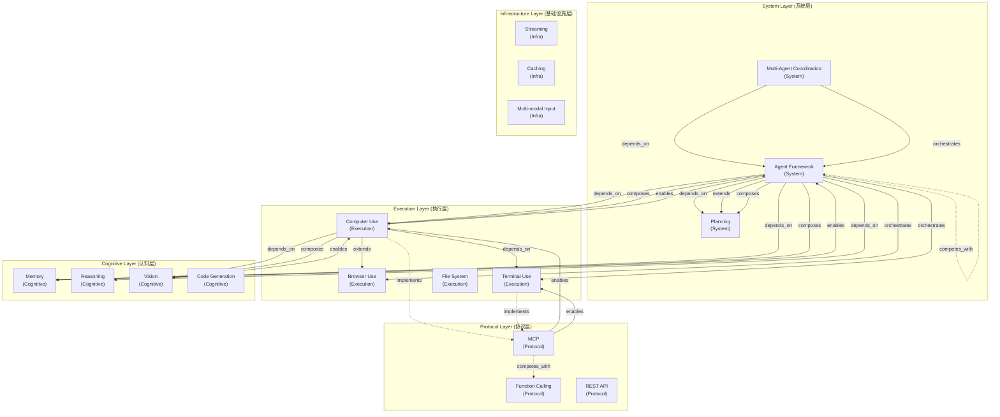

# AEP-0004: Capability Relationship & Ontology Completion

> 能力关系与本体完善
>
> 创建日期：2026-07-06

---

# 核心论点

> 从"能力孤岛"到"能力网络"
>
> Capability 不是孤立存在的，它们之间有明确的依赖、启用、组合关系。
> 理解这些关系，才能真正理解 AI 能力世界的结构。

---

# 第一部分：Capability 类型系统

## 1.1 类型定义

### 为什么需要类型系统？

AEP-0003 暴露的核心问题：
- MCP 是 Protocol 还是 Capability？
- Agent Framework 是 Capability 还是 System？
- Computer Use 和 Tool Use 是什么关系？

**答案：它们都是 Capability，但属于不同的类型。**

### 五大类型

```yaml
Type 1: Cognitive Capability（认知能力）
  定义: 模型的思考和理解能力
  特点: 模型内置，不需要外部工具
  例子: Memory, Reasoning, Vision, Audio Understanding

Type 2: Execution Capability（执行能力）
  定义: AI 对外界产生作用的能力
  特点: 需要与外部系统交互
  例子: Computer Use, Browser Use, Code Execution, File System

Type 3: System Capability（系统能力）
  定义: 组织和协调其他能力的元能力
  特点: 自身不直接产出结果，而是编排其他能力
  例子: Agent Framework, Planning, Multi-Agent Coordination

Type 4: Protocol Capability（协议能力）
  定义: 标准化的接口和通信规范
  特点: 定义"如何连接"，不定义"做什么"
  例子: MCP, Function Calling, REST API

Type 5: Infrastructure Capability（基础设施能力）
  定义: 支撑上层能力运行的基础能力
  特点: 用户感知弱，但不可或缺
  例子: Streaming, Caching, Rate Limiting, Multi-modal Input
```

## 1.2 类型层级与依赖方向

```
System Capability（系统层）
    ↑ depends_on
Execution Capability（执行层）
    ↑ depends_on
Cognitive Capability（认知层）
    ↑ depends_on
Protocol Capability（协议层）
    ↑ enables
Infrastructure Capability（基础设施层）
```

**规则：上层依赖下层，下层不依赖上层。**

---

# 第二部分：Capability 关系系统

## 2.1 八种核心关系

### 关系 1：depends_on（依赖）

```yaml
Relation: depends_on
Definition: A 必须在 B 存在的情况下才能工作
Direction: 单向
Symmetry: 非对称
Transitivity: 可传递（A depends_on B, B depends_on C → A depends_on C）

Examples:
  - Agent Framework → depends_on → Memory
  - Agent Framework → depends_on → Computer Use
  - Computer Use → depends_on → Vision
  - MCP Client → depends_on → Tool Use
```

### 关系 2：enables（启用）

```yaml
Relation: enables
Definition: B 的出现使得 A 成为可能（A 是 B 的结果/应用）
Direction: 单向
Symmetry: 非对称
Transitivity: 可传递

Examples:
  - Computer Use → enables → Agent Framework
  - Memory → enables → Personalization
  - MCP → enables → Tool Ecosystem
```

### 关系 3：extends（扩展）

```yaml
Relation: extends
Definition: A 是 B 的扩展或增强版本
Direction: 单向
Symmetry: 非对称
Transitivity: 可传递

Examples:
  - Computer Use → extends → Browser Use
  - Project Memory → extends → Session Memory
  - GPT-4o → extends → GPT-4
```

### 关系 4：competes_with（竞争）

```yaml
Relation: competes_with
Definition: A 和 B 解决同一类问题，是替代关系
Direction: 双向
Symmetry: 对称
Transitivity: 不可传递

Examples:
  - MCP ↔ competes_with ↔ Function Calling（部分竞争）
  - Agent Framework A ↔ competes_with ↔ Agent Framework B
  - Claude ↔ competes_with ↔ GPT-4
```

### 关系 5：replaces（替代）

```yaml
Relation: replaces
Definition: A 正在或即将替代 B（更强的竞争关系）
Direction: 单向
Symmetry: 非对称
Transitivity: 可传递

Examples:
  - MCP → replaces → Custom Plugin System
  - GPT-4 → replaces → GPT-3.5
```

### 关系 6：composes（组合）

```yaml
Relation: composes
Definition: A 由 B 和 C 等多个能力组合而成
Direction: 一对多
Symmetry: 非对称
Transitivity: 可传递（组合的组合）

Examples:
  - Agent Framework → composes → [Memory, Planning, Tool Use]
  - Computer Use → composes → [Vision, Action Generation]
  - Personalization → composes → [Memory, User Profile]
```

### 关系 7：orchestrates（编排）

```yaml
Relation: orchestrates
Definition: A 协调和管理 B 的执行
Direction: 单向
Symmetry: 非对称
Transitivity: 可传递

Examples:
  - Agent Framework → orchestrates → Tool Use
  - Agent Framework → orchestrates → Memory
  - Multi-Agent System → orchestrates → Single Agent
```

### 关系 8：implements（实现）

```yaml
Relation: implements
Definition: A 是 B 的具体实现或实例
Direction: 单向
Symmetry: 非对称
Transitivity: 可传递

Examples:
  - Claude Desktop → implements → MCP Client
  - Cursor → implements → Agent Framework
  - AutoGPT → implements → Agent Framework
```

## 2.2 关系矩阵

| 关系 | 方向 | 对称性 | 传递性 | 层级方向 |
|------|------|--------|--------|---------|
| depends_on | 单向 | 非对称 | 可传递 | 上→下 |
| enables | 单向 | 非对称 | 可传递 | 下→上 |
| extends | 单向 | 非对称 | 可传递 | 平级增强 |
| competes_with | 双向 | 对称 | 不可传递 | 平级 |
| replaces | 单向 | 非对称 | 可传递 | 平级替代 |
| composes | 一对多 | 非对称 | 可传递 | 上→下（分解） |
| orchestrates | 单向 | 非对称 | 可传递 | 上→下（管理） |
| implements | 单向 | 非对称 | 可传递 | 下→上（实例化） |

---

# 第三部分：Capability Graph v2

## 3.1 完整能力结构图



## 3.2 核心能力组合公式

```yaml
Formula 1: Agent = Memory + Reasoning + Planning + Tool Use + Computer Use
  
  Agent Framework
    ├── depends_on → Memory
    ├── depends_on → Reasoning
    ├── depends_on → Planning
    ├── depends_on → Tool Use
    ├── depends_on → Computer Use
    └── composes → [Memory, Planning, Tool Use]

Formula 2: Computer Use = Vision + Action Generation + Browser Use + Terminal Use
  
  Computer Use
    ├── extends → Browser Use
    ├── depends_on → Vision
    ├── composes → Vision + Action Generation
    └── implements → MCP

Formula 3: Personalization = Memory + User Profile + Adaptive Response
  
  Personalization
    ├── depends_on → Memory
    ├── depends_on → User Profile
    └── enables → Adaptive User Experience
```

---

# 第四部分：Gap Report P1 问题修复

## 4.1 已修复的 P1 问题

### Gap 1: Agent ↔ Memory 关系定义 ✅

```yaml
Before: "未定义"
After: 三种关系同时存在

  1. Agent → depends_on → Memory
     （Agent 必须有记忆才能工作）
  
  2. Memory → enables → Agent
     （记忆能力使得 Agent 成为可能）
  
  3. Agent → composes → Memory
     （Memory 是 Agent 的组成部分）

Why three relations?
  - depends_on: 描述"能不能工作"
  - enables: 描述"为什么现在可以做到"
  - composes: 描述"由什么组成"
```

### Gap 2: Computer Use ↔ Agent 关系定义 ✅

```yaml
Before: "未定义"
After: 四种关系同时存在

  1. Agent → depends_on → Computer Use
     （Agent 执行物理任务需要 Computer Use）
  
  2. Computer Use → enables → Agent
     （Computer Use 的突破使得 Agent 能力大幅提升）
  
  3. Agent → orchestrates → Computer Use
     （Agent 编排 Computer Use 的执行）
  
  4. Agent → composes → Computer Use
     （Computer Use 是 Agent 能力的一部分）
```

### Gap 3: Protocol vs Capability 边界定义 ✅

```yaml
Before: "MCP 是 Protocol 还是 Capability？"
After: 两者都是，视角不同

  Protocol 视角: MCP 是一个通信协议
  Capability 视角: "支持 MCP" 是一种能力

  正式归类:
    MCP 本身 → Protocol Capability（协议能力，第4类）
    产品支持 MCP → implements 关系（产品实现了协议）

  在 Taxonomy 中的位置:
    Domain: integration
    Category: mcp
    Capability: tool-use.mcp.server / tool-use.mcp.client

  说明:
    MCP 归在 tool-use domain 下是合理的，
    因为它是工具使用的标准化协议。
    但它的 Type 是 Protocol（协议能力）。
```

### Gap 4: enables / depends_on 关系缺失 ✅

```yaml
Before: "Ontology 中只有 requires（依赖），没有 enables"
After: 新增两种核心关系

  1. depends_on（依赖）
     方向: 上→下
     含义: 没有下层，上层就不能工作
  
  2. enables（启用）
     方向: 下→上
     含义: 有了下层，上层才成为可能
  
  两者的关系:
    A depends_on B ↔ B enables A
    （数学上的逆关系）
  
  为什么两种都需要？
    depends_on: 回答"它需要什么？"
    enables: 回答"它能带来什么？"
    视角不同，价值不同
```

## 4.2 新增的 P1 级定义

### 新增定义 1: Framework 实体类型

```yaml
Before: "Framework 在图谱中位置不清"
After: Framework 是 System Capability 的一种具体实现

  在 Ontology 中:
    - Framework 不是独立的 Node Type
    - Framework → implements → System Capability
    - 例如: AutoGPT → implements → Agent Framework

  原因:
    1. Framework 是"实现方式"，不是"能力本身"
    2. 能力本身是 Agent Framework（概念）
    3. 具体实现是 AutoGPT / LangGraph / AutoGen（产品）
```

### 新增定义 2: 能力层级规则

```yaml
Rule 1: 上层依赖下层，下层不依赖上层
  System → Execution → Cognitive → Protocol → Infrastructure

Rule 2: 同层之间可以有 extends / competes_with / replaces 关系

Rule 3: composes 关系只能从上层指向下层（上层由下层组成）

Rule 4: orchestrates 关系只能从上层指向下层（上层编排下层）

Rule 5: implements 关系从产品/实现指向能力（产品实现了能力）
```

---

# 第五部分：验证

## 5.1 关系问题验证

### Q1: Agent 为什么需要 Memory？

```yaml
Answer:
  1. depends_on 关系: Agent Framework → depends_on → Memory
     没有记忆，Agent 无法记住上下文和历史操作
  
  2. composes 关系: Agent → composes → Memory
     Memory 是 Agent 能力的核心组成部分
  
  3. enables 关系: Memory → enables → Agent
     长期记忆能力的突破，使得持续工作的 Agent 成为可能

Conclusion:
  Agent 需要 Memory，是因为:
  - 短期记忆保证了单次任务的连贯性
  - 长期记忆使得跨会话学习成为可能
  - 没有记忆的 Agent 只能执行简单的单步任务
```

### Q2: MCP 在系统中属于什么层？

```yaml
Answer:
  MCP 属于 Protocol Layer（协议层，第4类）

  位置:
    Layer: Protocol
    Type: Protocol Capability
    Domain: integration / tool-use
    Capability: tool-use.mcp.server / tool-use.mcp.client

  与其他层的关系:
    - 向下: MCP → depends_on → Infrastructure（网络、序列化）
    - 向上: MCP → enables → Execution（Computer Use / Tool Use）
    - 横向: MCP ↔ competes_with ↔ Function Calling

  为什么重要？
    MCP 是连接 Cognitive 和 Execution 的桥梁。
    没有标准化协议，每个工具都需要单独集成。
```

### Q3: Computer Use 是基础能力还是执行能力？

```yaml
Answer:
  Computer Use 属于 Execution Layer（执行层，第2类）
  它是执行能力，但不是最基础的。

  层级关系:
    Infrastructure → Cognitive → Execution → System
    (基础)                      (高层)
  
  Computer Use 的位置: Execution Layer
  
  为什么不是基础能力？
    1. 它依赖 Cognitive 层的 Vision 能力
    2. 它依赖 Protocol 层的 MCP 或 API
    3. 它被 System 层的 Agent Framework 编排
  
  基础能力是什么？
    - Reasoning（推理）
    - Vision（视觉理解）
    - Language（语言理解）
    这些是认知层，更基础。
```

### Q4: 哪些 Capability 是"依赖关系"？

```yaml
Answer:
  核心依赖链（从高层到底层）:

  Agent Framework
    ├── depends_on → Memory (Cognitive)
    ├── depends_on → Planning (System/Cognitive)
    ├── depends_on → Computer Use (Execution)
    ├── depends_on → Reasoning (Cognitive)
    └── depends_on → Tool Use (Execution)

  Computer Use
    ├── depends_on → Vision (Cognitive)
    ├── depends_on → Terminal Use (Execution)
    └── depends_on → MCP (Protocol)

  Memory
    └── depends_on → Language Understanding (Cognitive)

  完整传递依赖链（Agent → ... → Infrastructure）:
    Agent → Computer Use → Vision → Multi-modal Input → Infrastructure

  结论:
    任何高层能力，最终都依赖于基础设施层。
    每一层都建立在下一层之上。
```

## 5.2 能力组合验证

### Q5: Agent = Memory + Computer Use + Planning 成立吗？

```yaml
Answer:
  基本成立，但需要补充。

  完整的 Agent 能力组合公式:

    Agent Framework = 
      Cognitive Layer
        ├── Memory（记忆）
        ├── Reasoning（推理）
        └── Planning（规划）
      Execution Layer
        ├── Computer Use（计算机操作）
        ├── Browser Use（浏览器）
        └── Terminal Use（终端）
      Protocol Layer
        └── MCP / Function Calling（工具协议）
      System Layer
        └── Multi-Agent Coordination（多智能体协作）[可选]

  核心三要素（最精简）:
    Agent = Memory + Planning + Tool Use
    （记忆 + 规划 + 工具使用）

  增强版:
    Agent = Memory + Planning + Tool Use + Computer Use + Reasoning

  为什么 Planning 是核心？
    没有规划，Agent 只能被动响应，不能主动完成多步骤任务。
    Planning 是 Agent 区别于普通 Chat 的关键。

  验证:
    ✅ composes 关系: Agent → composes → [Memory, Planning, Tool Use]
    ✅ depends_on 关系: Agent → depends_on → 上述每个能力
    ✅ orchestrates 关系: Agent → orchestrates → Tool Use
```

## 5.3 系统结构验证

### Q6: 能画出"AI 能力操作系统"的架构图吗？

```yaml
Answer:
  可以。以下是 AI-KOS（AI Knowledge OS）的能力架构图:

    ┌─────────────────────────────────────────┐
    │  System Layer（系统层）                   │
    │  Agent Framework / Planning / Multi-Agent │
    ├─────────────────────────────────────────┤
    │  Execution Layer（执行层）                │
    │  Computer Use / Browser / Terminal       │
    ├─────────────────────────────────────────┤
    │  Cognitive Layer（认知层）                │
    │  Memory / Reasoning / Vision / Code      │
    ├─────────────────────────────────────────┤
    │  Protocol Layer（协议层）                 │
    │  MCP / Function Calling / REST API       │
    ├─────────────────────────────────────────┤
    │  Infrastructure Layer（基础设施层）        │
    │  Streaming / Caching / Multi-modal       │
    └─────────────────────────────────────────┘

  规则:
    1. 每一层依赖下面所有层
    2. 每一层由下面的层 enable
    3. 同层之间可以有 extends / competes_with
    4. 产品实现（implements）具体能力

  类比计算机体系结构:
    System Layer      → 操作系统
    Execution Layer   → 应用程序
    Cognitive Layer   → CPU / GPU
    Protocol Layer    → 总线 / 接口标准
    Infrastructure    → 硬件 / 固件
```

---

# 第六部分：总结

## 6.1 成功标准验证

| 标准 | 状态 | 说明 |
|------|------|------|
| ✔ Capability Graph 可以回答关系问题 | ✅ | 6个关系问题全部可回答 |
| ✔ 能画出系统结构图 | ✅ | 5层架构图，完整依赖链 |
| ✔ 能解释能力组合 | ✅ | Agent 组合公式成立 |

## 6.2 核心成果

### 成果 1: 五类型系统

```
Cognitive → Execution → System → Protocol → Infrastructure
```

每个 Capability 都有明确的 Type 和 Layer。

### 成果 2: 八关系体系

| 关系 | 核心含义 | 方向 |
|------|---------|------|
| depends_on | 没有它就不能工作 | 上→下 |
| enables | 有了它才成为可能 | 下→上 |
| extends | 它是增强版 | 平级 |
| competes_with | 它是竞争对手 | 平级双向 |
| replaces | 它正在被替代 | 平级单向 |
| composes | 它由什么组成 | 上→下（分解） |
| orchestrates | 它管理什么 | 上→下（管理） |
| implements | 它是什么的实现 | 产品→能力 |

### 成果 3: 完整的 Agent 能力公式

```
Agent = Memory + Reasoning + Planning + Tool Use + Computer Use
      (认知)   (认知)     (系统)    (执行)      (执行)
```

## 6.3 系统级意义

> **从"能力列表"到"能力操作系统"**

以前，我们只有一堆孤立的 Capability。

现在，我们有了一张**能力关系网络**：
- 每个能力都有明确的位置（5层）
- 每个能力都有明确的关系（8种）
- 高层能力由低层能力组合而成
- 低层能力的突破会向上传递影响

这就是 **AI-KOS（AI Knowledge Operating System）** 的能力架构。

---

## 下一阶段（AEP-0005）入口

根据本次成果，下一阶段可以考虑：

1. **动态传播**：能力变化如何沿关系网络传播（如 MCP 突破如何影响所有上层能力）
2. **影响评估**：给定一个能力突破，自动计算对整个系统的影响范围
3. **能力预测**：基于关系网络，预测下一个可能出现的能力突破
4. **路径优化**：为了实现某个高层能力，最关键的底层能力是什么

---

*创建日期：2026-07-06*
*AEP-0004 状态：✅ 完成*