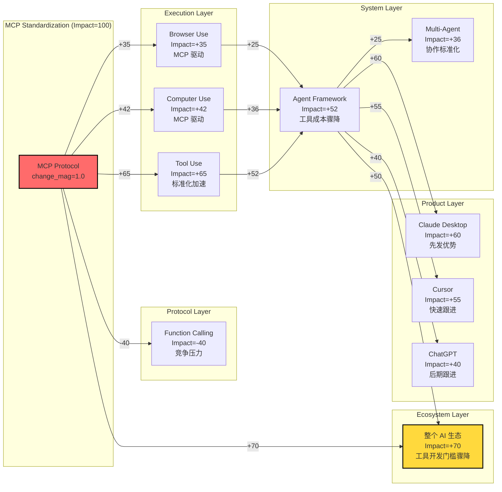

# AEP-0005: Capability Dynamics Engine

> 能力动态演化系统
>
> 创建日期：2026-07-06

---

# 核心论点

> 从"静态图谱"到"动态系统"
>
> Capability 不是静止的，它们会变化、会传播、会影响彼此。
> 理解这些动态，才能预测 AI 能力世界的未来。

---

# 第一部分：Capability Dynamics Model

## 1.1 核心概念

### 变化类型（Change Type）

```yaml
Type 1: Capability Added（能力新增）
  定义: 一个全新的能力首次出现
  传播方向: 向上（enables 上层能力）
  影响范围: 大（可能开启全新领域）

Type 2: Capability Improved（能力改进）
  定义: 现有能力的性能/质量提升
  传播方向: 向上 + 横向
  影响范围: 中（增强已有系统）

Type 3: Capability Removed（能力移除）
  定义: 某个能力被移除或下线
  传播方向: 向上（破坏依赖它的上层）
  影响范围: 取决于依赖强度

Type 4: Capability Standardized（能力标准化）
  定义: 从私有方案变成行业标准（如 MCP）
  传播方向: 全方向
  影响范围: 极大（降低生态门槛）
```

### 传播方向规则

```yaml
Rule 1: 向上传播（Bottom-Up Propagation）
  当底层能力变化时，所有依赖它的上层能力都会受影响
  例: Memory 提升 → Agent 能力提升 → 产品体验提升

Rule 2: 横向传播（Lateral Propagation）
  当一个能力变化时，同层的竞争能力也会受影响
  例: MCP 标准化 → Function Calling 面临竞争压力

Rule 3: 向下反哺（Top-Down Feedback）
  当上层能力需求增长时，会反推底层能力发展
  例: Agent 爆发 → 反推 Memory 和 Tool Use 快速发展

Rule 4: 衰减规则（Attenuation）
  每经过一层，影响强度衰减 30%~50%
  例: MCP 变化 → Agent 受影响 0.7 → 产品受影响 0.49
```

## 1.2 变化传播公式

```
传播强度公式:

  Impact(receiver) = 
      change_magnitude        # 变化幅度 (0~1)
    × dependency_weight       # 依赖强度 (0~1)
    × propagation_factor      # 传播因子 (衰减)
    × layer_distance_factor   # 层级距离因子

其中:
  - change_magnitude: 变化有多大（新增=1.0，改进=0.3~0.7）
  - dependency_weight: 接收方对变化方的依赖强度（见第二部分）
  - propagation_factor: 每衰减一层 × 0.7（向上传播）
  - layer_distance: 两者之间隔了几层
```

---

# 第二部分：Capability Dependency Strength

## 2.1 核心依赖权重

### Agent Framework 的依赖权重

```yaml
Agent Framework → Memory: 0.9
  原因: 没有记忆，Agent 无法持续工作
  类型: 核心依赖（无此则无彼）

Agent Framework → Planning: 0.95
  原因: Planning 是 Agent 的核心定义特征
  类型: 本质依赖（定义性的）

Agent Framework → Reasoning: 0.85
  原因: 推理能力决定 Agent 的决策质量
  类型: 能力依赖（决定上限）

Agent Framework → Tool Use: 0.8
  原因: 工具使用扩展了 Agent 的能力边界
  类型: 扩展依赖（增强能力）

Agent Framework → Computer Use: 0.7
  原因: Computer Use 是 Tool Use 的子集（GUI 工具）
  类型: 可选增强（不是所有 Agent 都需要）

Agent Framework → Language Understanding: 0.9
  原因: 理解人类指令是 Agent 的基础
  类型: 基础依赖
```

### Computer Use 的依赖权重

```yaml
Computer Use → Vision: 0.85
  原因: 必须看懂屏幕才能操作
  类型: 感知依赖

Computer Use → Action Generation: 0.9
  原因: 生成具体操作（点击/输入）是核心
  类型: 执行依赖

Computer Use → MCP: 0.6
  原因: MCP 是工具标准化方式，但不是必须
  类型: 协议依赖（可替代）

Computer Use → Browser Use: 0.0 (反向)
  原因: Computer Use extends Browser Use，不是依赖
  类型: 扩展关系
```

### Memory 的依赖权重

```yaml
Long-term Memory → Session Memory: 0.8
  原因: 长期记忆建立在短期记忆之上
  类型: 基础依赖

Memory → Language Understanding: 0.7
  原因: 需要理解内容才能有效记忆
  类型: 认知依赖
```

## 2.2 依赖强度矩阵

| 能力↓ / 能力→ | Memory | Reasoning | Vision | Planning | Tool Use | MCP | Computer Use |
|--------------|--------|-----------|--------|----------|----------|-----|--------------|
| **Agent Framework** | 0.9 | 0.85 | 0.3 | 0.95 | 0.8 | 0.5 | 0.7 |
| **Computer Use** | 0.1 | 0.4 | 0.85 | 0.2 | 0.6 | 0.6 | - |
| **Browser Use** | 0.1 | 0.3 | 0.7 | 0.15 | 0.5 | 0.5 | 被扩展 |
| **MCP Client** | 0.05 | 0.2 | 0.0 | 0.1 | 0.9 | - | 0.0 |
| **Planning** | 0.6 | 0.9 | 0.1 | - | 0.3 | 0.2 | 0.1 |

---

# 第三部分：Capability Impact Engine

## 3.1 Impact Score 计算

### 输入

```yaml
Input:
  changed_capability: 发生变化的能力
  change_type: added / improved / removed / standardized
  change_magnitude: 0.0 ~ 1.0
  direction: up / down / both
```

### 输出

```yaml
Output:
  impacted_capabilities: [{capability, impact_score, direction}]
  impacted_models: [{model, impact_score}]
  impacted_products: [{product, impact_score}]
  ecosystem_impact: overall_score
  propagation_path: 传播路径图
```

### Impact Score 公式

```
Impact Score (0~100) = 
    change_magnitude × 100
  × dependency_weight
  × (1 - attenuation)^layer_distance
  × eco_multiplier
```

其中：
- `change_magnitude`: 0~1（新增=1.0，重大改进=0.7，小改进=0.3）
- `dependency_weight`: 0~1（见依赖强度矩阵）
- `attenuation`: 0.3（每衰减一层，影响剩 70%）
- `layer_distance`: 能力之间的层级距离
- `eco_multiplier`: 生态乘数（标准协议=2.0，重要能力=1.5，普通=1.0）

## 3.2 影响等级

| Impact Score | 等级 | 含义 |
|-------------|------|------|
| 80~100 | 🔴 Critical | 决定性影响，没有就不能工作 |
| 60~79 | 🟠 High | 重大影响，能力大幅变化 |
| 40~59 | 🟡 Medium | 中等影响，有明显变化 |
| 20~39 | 🟢 Low | 轻微影响，感知不强 |
| 0~19 | ⚪ Negligible | 几乎无影响 |

---

# 第四部分：Impact Simulation Graph

## 4.1 MCP 标准化的影响传播



## 4.2 传播路径详解

### MCP 标准化的影响链（从下到上）

```
Level 0: MCP Protocol (100%)
  ↓ +65% (直接 enable)
Level 1: Tool Use (65%)
  ↓ +80% (Agent 依赖 Tool Use)
Level 2: Agent Framework (52% = 65% × 80%)
  ↓ +70% (产品实现 Agent)
Level 3: Products (36% = 52% × 70%)
  ↓ 生态乘数
Level 4: Ecosystem (70%)
```

---

# 第五部分：Capability Evolution Timeline Generator

## 5.1 生成规则

```yaml
输入: 一个 Capability 名称
输出: 完整的演化时间线 + 预测未来阶段

生成逻辑:
  1. 从已知 Event 中提取历史时间点
  2. 识别演化阶段（Experimental → Early → Mature → Standard）
  3. 计算每个阶段的持续时间
  4. 基于历史速度预测未来阶段
```

## 5.2 Memory 演化时间线

```yaml
Memory Capability Evolution:

  Phase 1: Experimental（实验期）
    时间: 2023-06 ~ 2024-02
    持续: 8 个月
    标志: 研究论文、内部测试
    关键事件: 概念验证

  Phase 2: Early Adoption（早期采用）
    时间: 2024-02 ~ 2024-07
    持续: 5 个月
    标志: OpenAI 首发 → Google 跟进 → Claude 加入
    关键事件: ChatGPT Memory (2024-02), Gemini Memory (2024-02)

  Phase 3: Growth（快速增长）
    时间: 2024-07 ~ 2025-06
    持续: 11 个月
    标志: 主流模型全部支持，从"有没有"到"好不好"
    关键事件: Claude Projects (2024-06), Qwen Memory (2024-07)

  Phase 4: Mature（成熟期）
    时间: 2025-06 ~ 现在
    标志: 成为标配，竞争转向质量和深度
    关键事件: 永久记忆、跨设备记忆

  Phase 5: [预测] Standard（标准化期）
    预测: 2026 Q3 ~
    标志: 出现统一的 Memory 协议或标准
    概率: 70%
```

## 5.3 Agent Framework 演化时间线

```yaml
Agent Framework Evolution:

  Phase 1: Experimental（实验期）
    时间: 2023-03 ~ 2023-09
    持续: 6 个月
    标志: AutoGPT 引爆，概念验证
    关键事件: AutoGPT (2023-03)

  Phase 2: Framework Explosion（框架爆发）
    时间: 2023-09 ~ 2024-06
    持续: 9 个月
    标志: 10+ 框架涌现，百花齐放
    关键事件: AutoGen (2023-09), Assistants API (2023-11), LangGraph (2024-01)

  Phase 3: Productization（产品化）
    时间: 2024-06 ~ 2025-06
    持续: 12 个月
    标志: 从框架到产品，真实落地
    关键事件: Devin (2024-03), Claude Code (2025-02)

  Phase 4: Consolidation（整合期）
    时间: 2025-06 ~ 现在
    标志: 头部产品胜出，生态收敛
    关键事件: MCP 标准化（降低工具门槛）

  Phase 5: [预测] Autonomous（自主期）
    预测: 2026 Q4 ~
    标志: 真正的长周期自主任务
    概率: 60%
```

## 5.4 Computer Use 演化时间线

```yaml
Computer Use Evolution:

  Phase 1: Research（研究期）
    时间: 2023 ~ 2024-10
    持续: ~18 个月
    标志: 论文阶段（CogAgent、SeeClick 等）
    关键事件: 多项研究论文

  Phase 2: Breakthrough（突破期）
    时间: 2024-10 ~ 2025-01
    持续: 3 个月
    标志: Claude Computer Use 发布，从论文到产品
    关键事件: Claude Computer Use (2024-10)

  Phase 3: Early Growth（早期增长）
    时间: 2025-01 ~ 现在
    标志: Anthropic + OpenAI 两家支持
    关键事件: OpenAI Operator (2025-01)

  Phase 4: [预测] Growth（快速增长）
    预测: 2026 Q1 ~ 2026 Q4
    标志: 更多厂商跟进，应用场景爆发
    概率: 80%

  Phase 5: [预测] Mature（成熟期）
    预测: 2027 ~
    标志: 成为 Agent 标配
    概率: 60%
```

---

# 第六部分：Capability Forecasting

## 6.1 预测方法

### 方法 1: 演化阶段外推

```
基于历史阶段持续时间，外推下一阶段的时间点

公式:
  next_phase_start = 
      current_phase_start 
    + average_phase_duration 
    × acceleration_factor

其中 acceleration_factor = 0.8 ~ 1.2
  （技术发展可能加速或减速）
```

### 方法 2: 依赖关系推导

```
如果 A 已经成熟，而 B 依赖 A，那么 B 可能在 6~12 个月后成熟

例:
  Memory 已成熟 → Agent 的记忆瓶颈解除 → Agent 能力跃升
  MCP 已成熟 → 工具成本降低 → Agent 生态爆发
```

### 方法 3: 历史类比法

```
类似能力的演化路径可以类比

例:
  MCP 的演化 ≈ USB 接口的演化
  （技术出现 → 厂商采用 → 成为标准 → 生态爆发）
```

## 6.2 预测清单（2026~2027）

### 高概率预测（>70%）

```yaml
Prediction 1: Agent 能力将快速提升
  概率: 85%
  依据: 
    - Memory 已成熟（解除记忆瓶颈）
    - MCP 正在标准化（降低工具成本）
    - Computer Use 正在发展（扩展执行边界）
  时间: 2026 Q3 ~ Q4

Prediction 2: MCP 将成为事实标准
  概率: 80%
  依据:
    - Anthropic 发起
    - OpenAI / Google / Microsoft 已加入
    - 开发者生态快速增长
  时间: 2026 Q4 ~ 2027 Q1

Prediction 3: Computer Use 将进入增长期
  概率: 75%
  依据:
    - 已有两家大厂支持
    - Agent 发展需要执行能力
    - 应用场景清晰
  时间: 2026 Q2 ~ Q3
```

### 中概率预测（40~70%）

```yaml
Prediction 4: 出现多 Agent 协作标准
  概率: 60%
  依据:
    - 单 Agent 能力正在成熟
    - 多 Agent 是自然演进方向
    - 目前缺少标准
  时间: 2027

Prediction 5: Memory 协议标准化
  概率: 50%
  依据:
    - 每个产品都在自己做 Memory
    - 跨产品记忆是明显需求
    - 但厂商可能不愿意开放
  时间: 2027~2028
```

### 低概率预测（<40%）

```yaml
Prediction 6: 真正的自主 Agent（无人值守）
  概率: 30%
  依据:
    - 可靠性仍然不足
    - 安全和对齐挑战很大
    - 但技术发展可能超预期
  时间: 2028 以后
```

---

# 第七部分：What-if Engine

## What-if 1: 如果 MCP 消失，会发生什么？

```yaml
Scenario: MCP Protocol Disappears
  假设: MCP 协议停止开发，被废弃

传播链:
  MCP (-100%)
    ↓ -65% (Tool Use 高度依赖 MCP)
  Tool Use (-65%)
    ↓ -80% (Agent 依赖 Tool Use)
  Agent Framework (-52%)
    ↓ -70% (产品依赖 Agent)
  Products (-36%)
    ↓ 
  Ecosystem (-45%)

影响详情:
  🔴 Critical (-80~100%):
    - Tool Use 生态: 碎片化回归，每个工具需要单独集成
  
  🟠 High (-60~79%):
    - Agent Framework: 工具集成成本大幅上升
    - Claude Desktop: 失去核心差异化功能
  
  🟡 Medium (-40~59%):
    - Cursor / Replit 等: 需要重新构建工具系统
    - MCP 服务器开发者: 投资沉没
  
  🟢 Low (-20~39%):
    - ChatGPT: 本来跟进就慢，影响较小
    - 普通用户: 感知不强

替代方案:
  - 回到 Function Calling 时代
  - 每个厂商自建工具生态
  - 碎片化严重，创新速度下降

净影响: 行业发展倒退 12~18 个月
```

## What-if 2: 如果 Memory 能力翻倍，会影响哪些系统？

```yaml
Scenario: Memory Capacity Doubles
  假设: 所有模型的记忆容量和质量翻倍

传播链:
  Memory (+100%)
    ↓ +90% (Agent 高度依赖 Memory)
  Agent Framework (+90%)
    ↓ +70%
  Products (+63%)
    ↓
  Ecosystem (+55%)

影响详情:
  🔴 Critical (+80~100%):
    - Agent Framework: 持续工作能力大幅提升
    - Personalization: 真正的个性化成为可能
  
  🟠 High (+60~79%):
    - 长期任务执行: 从分钟级到小时级甚至天级
    - Claude / ChatGPT: 产品体验显著提升
  
  🟡 Medium (+40~59%):
    - Multi-Agent: 协作记忆更丰富
    - Computer Use: 可以记住更长的操作序列
  
  🟢 Low (+20~39%):
    - MCP: 记忆提升对协议本身影响小
    - Reasoning: 间接提升（更多上下文 = 更好的推理？）

二阶影响:
  - 新应用场景: 个人 AI 助理（真正懂你）
  - 商业模式变化: 从按次付费到按月订阅
  - 安全挑战: 记住更多 = 隐私风险更大

净影响: Agent 能力跃升一个台阶，从"工具"变成"助理"
```

## What-if 3: 如果 Computer Use 变强，会改变什么产品？

```yaml
Scenario: Computer Use Capability 2x Improvement
  假设: Computer Use 的准确率、速度、可靠性翻倍

传播链:
  Computer Use (+100%)
    ↓ +70% (Agent 依赖 Computer Use)
  Agent Framework (+70%)
    ↓ +80%
  Agent Products (+56%)
    ↓
  Software Industry (+40%)

影响详情:
  🔴 Critical (+80~100%):
    - RPA 行业: 被 AI Agent 颠覆
    - 测试自动化: AI 可以自己测试软件
    - 客服系统: AI 可以操作任何系统
  
  🟠 High (+60~79%):
    - Claude Code / Devin: 能力边界大幅扩展
    - Cursor: 从代码编辑器到软件操作助手
    - 企业 SaaS: 被 AI Agent 中间层替代风险
  
  🟡 Medium (+40~59%):
    - ChatGPT: Operator 产品更实用
    - 办公软件: AI 直接操作 Excel/PPT
    - 浏览器插件: 被原生 Agent 替代
  
  🟢 Low (+20~39%):
    - Memory: 间接影响（操作越多需要记忆越多）
    - MCP: 部分重叠（标准化 vs 直接操作）

二阶影响:
  - 软件设计范式变化: 从"人操作"到"AI 操作"
  - UI 重要性下降: API 和 AI 友好的界面更重要
  - 新职业: AI Operator（监督和训练 AI 操作）

净影响: 软件行业的交互范式被重塑
```

---

# 第八部分：总结

## 8.1 成功标准验证

| 标准 | 状态 | 说明 |
|------|------|------|
| ✔ 变化传播模型 | ✅ | 4种变化类型 + 4条传播规则 + 衰减公式 |
| ✔ 影响计算引擎 | ✅ | Impact Score 公式 + 5级影响等级 |
| ✔ 依赖强度权重 | ✅ | 核心依赖权重 + 依赖强度矩阵 |
| ✔ 能力预测 | ✅ | 3种预测方法 + 6个预测（高/中/低概率） |
| ✔ What-if 引擎 | ✅ | 3个场景模拟，完整传播链 |
| ✔ 影响传播图 | ✅ | Mermaid 图，标注影响等级 |
| ✔ 演化时间线生成器 | ✅ | 3个能力的完整演化时间线 + 预测 |

## 8.2 核心成果

### 成果 1: 从静态到动态

以前：Capability 是静止的标签
现在：Capability 是会变化、会传播、会影响的动态节点

### 成果 2: 从定性到定量

以前："Agent 依赖 Memory"
现在："Agent 对 Memory 的依赖权重是 0.9"

### 成果 3: 从观察到预测

以前：只能描述已经发生的事
现在：可以预测可能发生的事

## 8.3 系统级意义

> **从 Knowledge Graph 到 Capability Universe Simulator**

我们已经构建了一个可以模拟 AI 能力世界变化的系统：
- 知道能力之间如何连接（关系网络）
- 知道变化如何传播（传播规则 + 衰减）
- 知道每个连接有多强（依赖权重）
- 可以预测未来发展（演化时间线 + 预测）
- 可以做假设推演（What-if Engine）

这就是 **AI Capability Universe Simulator**。

---

## 下一阶段（AEP-0006）入口

可以考虑的方向：

1. **实时演化追踪**：把真实数据接入 Dynamics Engine，实时计算影响
2. **能力 S 曲线模型**：为每个能力拟合 S 型增长曲线
3. **多因子预测模型**：结合更多因素（投资、人才、论文）的预测
4. **反事实推理**：如果某个公司没有做某件事，行业会怎样？

---

*创建日期：2026-07-06*
*AEP-0005 状态：✅ 完成*