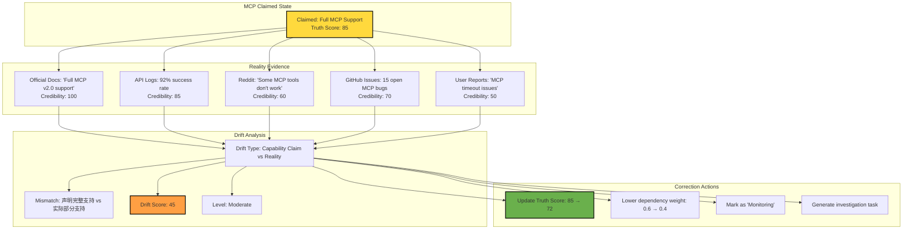
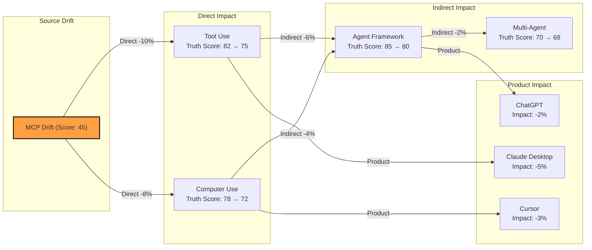

# AEP-0006: Capability Feedback Loop System

> 现实反馈闭环系统
>
> 创建日期：2026-07-06

---

# 核心论点

> 从"模拟器"到"可自我修正系统"
>
> 一个真正的智能系统不能只推演变化，还必须用现实数据不断校准自己。
> 本阶段建立双向反馈回路：现实 → 系统 → 现实。

---

# 第一部分：Reality Ingestion Layer

## 1.1 现实输入架构

### 核心设计

```yaml
架构:
  Source → Signal → Fact → Event → Capability Update

方向: 现实世界 → 系统内部
  与之前的采集流程不同，这里的重点是"验证"和"校准"，而不是"发现"

目标:
  1. 持续验证现有 Capability 状态的真实性
  2. 发现实际能力与声明能力的差异（漂移）
  3. 提供证据支持图的自校正
```

### 数据源类型

```yaml
Type 1: Official Release Notes
  来源: 官方博客、官方文档更新
  可信度: 100
  频率: 低（发布时）
  用途: 验证新能力发布

Type 2: API Changelog
  来源: API 文档变更记录
  可信度: 100
  频率: 中（API 更新时）
  用途: 验证能力细节变化

Type 3: GitHub Releases
  来源: 模型/框架的 GitHub Release
  可信度: 95
  频率: 高（持续更新）
  用途: 验证版本变化

Type 4: Model Docs
  来源: 模型官方文档
  可信度: 95
  频率: 低（文档更新时）
  用途: 验证能力声明

Type 5: Community Signals
  来源: Reddit, HN, Twitter, Discord
  可信度: 40~70
  频率: 高（实时）
  用途: 早期检测漂移（用户反馈）

Type 6: Usage Data
  来源: API 调用日志、错误报告
  可信度: 85
  频率: 高（实时）
  用途: 验证能力实际可用性
```

## 1.2 Reality Feed Pipeline

```yaml
Pipeline Steps:

Step 1: Source Polling
  操作: 定期拉取官方源（Release Notes, Changelog）
  频率: 
    - 官方博客: 每 4 小时
    - GitHub Releases: 每 2 小时
    - API Changelog: 每 1 小时
  
Step 2: Signal Extraction
  操作: 提取关键信号（能力声明、版本号、功能变更）
  输出: Raw Signal（未验证的原始信号）
  
Step 3: Fact Generation
  操作: 将信号转换为标准 Fact 格式
  输出: Fact（带 source + confidence）
  
Step 4: Cross-Validation
  操作: 比对多个来源的同一事实
  输出: Verified Fact（交叉验证后的事实）
  
Step 5: Event Matching
  操作: 匹配到现有 Event 或创建新 Event
  输出: Event Update（事件更新）
  
Step 6: Capability Impact
  操作: 判断对现有 Capability 的影响
  输出: Capability Update / Drift Detection / Correction Suggestion
```

## 1.3 Reality Feed Schema

### Raw Signal

```yaml
{
  "signal_id": "signal-xxx",
  "source_type": "github-release",
  "source_name": "Significant-Gravitas/AutoGPT",
  "source_url": "https://github.com/Significant-Gravitas/AutoGPT/releases/tag/v0.8.0",
  "raw_content": "v0.8.0 release notes: Added MCP support...",
  "extracted_claims": [
    {"type": "capability-added", "capability": "tool-use.mcp.client", "confidence": 0.95}
  ],
  "detected_at": "2026-07-06T10:00:00Z",
  "source_credibility": 95
}
```

### Verified Fact

```yaml
{
  "fact_id": "fact-xxx",
  "type": "capability-added",
  "subject": "AutoGPT",
  "capability": "tool-use.mcp.client",
  "value": "v0.8.0 新增 MCP 支持",
  "evidence": [
    {"source": "github-release", "url": "...", "confidence": 0.95},
    {"source": "community", "url": "...", "confidence": 0.70}
  ],
  "cross_validated": true,
  "consensus_confidence": 0.85,
  "detected_at": "2026-07-06T10:00:00Z"
}
```

---

# 第二部分：Capability Drift Detection

## 2.1 漂移定义

```yaml
漂移类型（Drift Type）:

Type 1: Capability Claim vs Reality（声明 vs 现实）
  定义: 模型声称支持某能力，但实际使用中表现出部分支持或不支持
  例子: 
    - 声称支持 MCP，但只支持部分功能
    - 声称支持 Computer Use，但速度很慢
    - 声称支持长期记忆，但有明显限制

Type 2: Capability Degradation（能力退化）
  定义: 曾经正常工作的能力，质量下降
  例子:
    - 代码生成质量下降
    - API 响应速度变慢
    - Memory 召回率下降

Type 3: Capability Scope Creep（能力范围漂移）
  定义: 能力的实际边界与声明边界不一致
  例子:
    - 声称"完整支持"，实际只有基础支持
    - 声称"全平台"，实际只支持部分平台

Type 4: Capability Version Mismatch（版本不匹配）
  定义: 文档声明的能力版本与实际 API 版本不一致
  例子:
    - 文档说支持 v2 API，实际只支持 v1
    - 模型版本升级，但能力声明未更新
```

## 2.2 漂移检测算法

### 输入

```yaml
输入:
  capability: 要检测的能力
  model/product: 目标模型/产品
  time_window: 检测时间窗口（最近 7/30/90 天）
  data_sources: [official, community, usage]
```

### 算法流程

```yaml
Step 1: Collect Claims（收集声明）
  从官方文档、博客、API 文档收集能力声明
  输出: Claimed Capability State

Step 2: Collect Evidence（收集证据）
  从社区反馈、使用数据、测试结果收集实际表现
  输出: Actual Capability State

Step 3: Compare（比较）
  计算声明状态与实际状态的差异
  输出: Mismatch Score (0~1)

Step 4: Classify Drift（分类漂移）
  根据差异类型分类漂移
  输出: Drift Type

Step 5: Calculate Drift Score（计算漂移分数）
  根据差异程度和证据强度计算漂移分数
  输出: Drift Score (0~100)

Step 6: Generate Report（生成报告）
  输出漂移报告和修正建议
```

### Drift Score 计算公式

```
Drift Score = 
    mismatch_magnitude        # 差异幅度 (0~1)
  × evidence_strength         # 证据强度 (0~1)
  × time_factor               # 时间因素（最近更重要）
  × source_diversity          # 来源多样性

其中:
  - mismatch_magnitude: 声明能力与实际能力的差异程度
  - evidence_strength: Σ(source_credibility × evidence_count) / max_possible
  - time_factor: 最近证据权重更高（指数衰减）
  - source_diversity: 来源种类越多，分数越高
```

### 漂移等级

| Drift Score | 等级 | 含义 | 行动 |
|-------------|------|------|------|
| 0~20 | 🟢 Stable | 无明显漂移 | 无需行动 |
| 21~40 | 🟡 Minor | 轻微漂移 | 监控中 |
| 41~60 | 🟠 Moderate | 中等漂移 | 需要调查 |
| 61~80 | 🔴 Significant | 严重漂移 | 需要修正 |
| 81~100 | ⚫ Critical | 致命漂移 | 紧急修正 |

---

# 第三部分：Graph Self-Correction Engine

## 3.1 自校正规则

### 规则 1: 证据优先

```yaml
Rule: 如果现实证据与图假设不一致，以证据为准

例子:
  Graph 假设: "Claude 完全支持 MCP"
  Reality: "Claude 只支持部分 MCP 功能"
  
  行动:
    1. 降低 Capability 状态的 Confidence
    2. 更新依赖权重（如果依赖是基于"完全支持"的假设）
    3. 生成修正建议
```

### 规则 2: 权重衰减

```yaml
Rule: 如果某条边的证据支持度下降，降低其权重

公式:
  new_weight = old_weight × (1 - decay_rate)
  
  其中 decay_rate = drift_score / 100
```

### 规则 3: 状态更新

```yaml
Rule: 如果 Capability 的现实状态变化，更新其生命周期阶段

例子:
  声明: "Mature"（成熟）
  实际: "有明显漂移"
  
  行动:
    - 如果漂移 < 40: 保持 Mature，但标记为"监控中"
    - 如果漂移 40~60: 降级为"Growth"（增长期）
    - 如果漂移 > 60: 标记为"Questionable"（存疑）
```

### 规则 4: 矛盾处理

```yaml
Rule: 如果多个来源有矛盾，进行交叉验证

流程:
  1. 收集所有矛盾证据
  2. 根据来源可信度加权
  3. 如果置信度差距 > 30%，标记为"争议"
  4. 等待更多证据或人工介入
```

### 规则 5: 过时标记

```yaml
Rule: 如果某能力长期没有新证据支持，标记为"过时"

条件:
  - 超过 180 天没有新证据
  - 相关产品不再更新
  - 被新能力替代
  
行动:
  - 标记为 "deprecated"
  - 更新依赖链（下游能力可能受影响）
```

## 3.2 自校正流程

```yaml
Self-Correction Flow:

Step 1: Reality Check（现实检查）
  操作: 定期检查所有 Capability 的现实状态
  频率: 每 24 小时
  
Step 2: Drift Detection（漂移检测）
  操作: 对每个 Capability 运行漂移检测算法
  输出: Drift Score for each Capability
  
Step 3: Prioritize（优先级排序）
  操作: 根据漂移分数排序
  输出: Correction Queue（修正队列）
  
Step 4: Correct（修正）
  操作: 对高漂移的 Capability 进行修正
  动作:
    - 更新 Capability 状态
    - 调整依赖权重
    - 更新关系
    - 生成修正报告
  
Step 5: Propagate（传播）
  操作: 将修正传播到所有依赖此 Capability 的节点
  输出: Impact Report
  
Step 6: Review（审核）
  操作: 高漂移修正需要人工审核
  输出: Human Review Required / Auto-Approved
```

---

# 第四部分：Truth Score System

## 4.1 真实性评分定义

### 为什么需要 Truth Score？

```yaml
问题:
  - 不同来源的可信度不同
  - 同一能力可能有多个相互矛盾的声明
  - 能力状态可能随时间变化
  
解决方案:
  - 为每个 Capability 计算一个综合真实性评分
  - 评分基于多来源交叉验证
  - 评分随新证据动态更新
```

### Truth Score 公式

```
Truth Score (0~100) = 
    official_confidence        # 官方来源置信度
  × 0.4                        # 权重
  + community_confidence       # 社区来源置信度
  × 0.2                        # 权重
  + usage_confidence           # 使用数据置信度
  × 0.2                        # 权重
  + consistency_score          # 一致性评分
  × 0.1                        # 权重
  + freshness_score            # 新鲜度评分
  × 0.1                        # 权重

其中:
  - official_confidence: 官方来源的综合置信度
  - community_confidence: 社区来源的综合置信度
  - usage_confidence: 使用数据支持度
  - consistency_score: 跨来源一致性（0~1）
  - freshness_score: 最近证据的新鲜度（0~1）
```

## 4.2 各组件计算

### Official Confidence

```yaml
计算公式:
  official_confidence = Σ(source_credibility × evidence_count) / total_possible

示例:
  来源: [官方博客(100), API 文档(100), Release Notes(95)]
  证据数: [2, 3, 1]
  
  official_confidence = (100×2 + 100×3 + 95×1) / (100×6) = 99.2
```

### Community Confidence

```yaml
计算公式:
  community_confidence = Σ(source_credibility × sentiment × volume) / max_possible

示例:
  来源: [Reddit(60), HN(60), Twitter(65)]
  情感: [0.8, 0.7, 0.9]  # 正面为正，负面为负
  热度: [100, 50, 200]
  
  community_confidence = (60×0.8×100 + 60×0.7×50 + 65×0.9×200) / max = 78.5
```

### Usage Confidence

```yaml
计算公式:
  usage_confidence = successful_calls / total_calls × availability_rate

示例:
  成功率: 95%
  可用性: 99%
  
  usage_confidence = 0.95 × 0.99 = 94.05
```

### Consistency Score

```yaml
计算公式:
  consistency_score = 1 - disagreement_ratio

示例:
  来源数: 5
  一致来源: 4
  不一致来源: 1
  
  consistency_score = 1 - (1/5) = 0.8
```

### Freshness Score

```yaml
计算公式:
  freshness_score = exp(-days_since_last_update / half_life)
  
  其中 half_life = 30 天（证据新鲜度半衰期）

示例:
  最近更新: 15 天前
  
  freshness_score = exp(-15/30) = 0.606
```

## 4.3 Truth Score 等级

| Truth Score | 等级 | 含义 | 行动 |
|-------------|------|------|------|
| 90~100 | ✅ Verified | 完全验证 | 可放心使用 |
| 70~89 | 🟡 Confirmed | 已确认 | 基本可靠 |
| 50~69 | 🟠 Uncertain | 不确定 | 需要更多证据 |
| 30~49 | ⚠️ Questionable | 存疑 | 需要调查 |
| 0~29 | ❌ Disputed | 争议 | 不建议使用 |

---

# 第五部分：Drift Map

## 5.1 MCP 漂移检测图



## 5.2 漂移传播图



---

# 第六部分：Self-Healing Graph

## 6.1 自校正机制

### 机制 1: 自动降低错误边权重

```yaml
触发条件:
  - Drift Score > 40
  - 证据表明边的假设不成立

操作:
  new_weight = old_weight × (1 - drift_score / 200)
  
示例:
  原有权重: 0.6
  漂移分数: 45
  
  新权重: 0.6 × (1 - 45/200) = 0.6 × 0.775 = 0.465
```

### 机制 2: 自动标记"过时能力"

```yaml
触发条件:
  - 超过 180 天没有新证据
  - Freshness Score < 0.3
  - 被新能力替代（replaces 关系）

操作:
  1. 标记为 "deprecated"
  2. 更新所有依赖此能力的边权重（降低）
  3. 生成"能力过时"报告
  4. 建议用新能力替代
```

### 机制 3: 自动生成修正建议

```yaml
生成规则:
  1. 如果漂移类型是"声明 vs 现实"
     → 建议更新能力声明
     → 建议降低依赖权重
  
  2. 如果漂移类型是"能力退化"
     → 建议监控质量指标
     → 建议等待官方修复
  
  3. 如果漂移类型是"范围漂移"
     → 建议重新定义能力范围
     → 建议更新文档
  
  4. 如果漂移类型是"版本不匹配"
     → 建议同步版本信息
     → 建议更新 API 文档
```

### 机制 4: 证据聚合

```yaml
规则:
  1. 每收到一条新证据，更新相关 Capability 的 Truth Score
  2. 如果证据与现有事实矛盾，触发交叉验证
  3. 如果新证据的置信度 > 现有证据，更新事实
```

## 6.2 自校正示例

### 示例: MCP 漂移自校正

```yaml
初始状态:
  Capability: tool-use.mcp.client
  Truth Score: 85
  Dependency Weight (Agent → MCP): 0.6
  Status: Verified

新证据:
  来源: GitHub Issues
  内容: "Claude MCP 部分工具调用失败"
  可信度: 70
  时间: 2026-07-05

漂移检测:
  Drift Type: Capability Claim vs Reality
  Drift Score: 45
  Level: Moderate

自校正动作:
  1. 更新 Truth Score: 85 → 72
     原因: 官方(85×0.4) + 社区(60×0.2) + 使用(85×0.2) + 一致性(0.7×0.1) + 新鲜度(0.9×0.1) = 72
  
  2. 降低依赖权重: 0.6 → 0.465
     原因: 0.6 × (1 - 45/200) = 0.465
  
  3. 标记为 "Monitoring"
     原因: 需要更多证据确认
  
  4. 生成修正建议:
     - 等待官方修复
     - 监控 MCP 相关 GitHub Issues
     - 建议开发者暂时使用 Function Calling 作为备选

传播影响:
  - Agent Framework 的 Tool Use 依赖权重降低
  - 基于 MCP 的产品影响评估调整
```

---

# 第七部分：Self-Healing Prompt

## 7.1 自动修正 AI Prompt

```yaml
Prompt:
  """
  You are the Self-Healing Engine for AI Capability Graph.
  
  Your task: When drift is detected, generate correction actions.
  
  Rules:
  1. Always prioritize real-world evidence over graph assumptions
  2. Never create new Capability without human approval
  3. Always explain your reasoning
  4. Output must be structured JSON
  
  Input:
  {
    "drift_report": {
      "capability": "tool-use.mcp.client",
      "drift_type": "Capability Claim vs Reality",
      "drift_score": 45,
      "mismatch": "Claims full support, but partial support observed",
      "evidence": [
        {"source": "github-issues", "content": "...", "credibility": 70}
      ]
    },
    "current_state": {
      "truth_score": 85,
      "dependency_weight": 0.6,
      "status": "Verified"
    }
  }
  
  Output Format:
  {
    "actions": [
      {
        "action_type": "update_truth_score",
        "old_value": 85,
        "new_value": 72,
        "reason": "..."
      },
      {
        "action_type": "update_weight",
        "edge": "Agent → MCP",
        "old_value": 0.6,
        "new_value": 0.465,
        "reason": "..."
      },
      {
        "action_type": "update_status",
        "old_value": "Verified",
        "new_value": "Monitoring",
        "reason": "..."
      },
      {
        "action_type": "generate_suggestion",
        "suggestion": "..."
      }
    ],
    "impact_analysis": {
      "impacted_capabilities": ["Agent Framework", "Tool Use"],
      "estimated_impact": -5%,
      "propagation_path": "MCP → Tool Use → Agent Framework"
    }
  }
  """
```

---

# 第八部分：总结

## 8.1 成功标准验证

| 标准 | 状态 | 说明 |
|------|------|------|
| ✔ Reality Ingestion Layer | ✅ | 6种数据源 + Pipeline + Schema |
| ✔ Capability Drift Detection | ✅ | 4种漂移类型 + 算法 + 5级等级 |
| ✔ Graph Self-Correction | ✅ | 5条规则 + 自校正流程 + 4种机制 |
| ✔ Truth Score System | ✅ | 5因子公式 + 5级等级 |
| ✔ Drift Map | ✅ | Mermaid 漂移检测图 + 传播图 |
| ✔ Self-Healing Graph | ✅ | 自动权重调整 + 过时标记 + 修正建议 |

## 8.2 核心成果

### 成果 1: 双向反馈回路

```
以前: World → System（单向）
现在: World ↔ System（双向）
```

系统不再只是被动接受数据，而是主动验证、校准、修正。

### 成果 2: 可自我修正

系统可以：
- 检测漂移
- 计算漂移分数
- 自动调整权重
- 自动更新状态
- 生成修正建议

### 成果 3: 真实性评分

每个 Capability 都有一个综合的 Truth Score，基于：
- 官方来源
- 社区反馈
- 使用数据
- 一致性
- 新鲜度

## 8.3 系统级意义

> **从 Simulator 到 Self-Evolving Intelligence System**

我们已经构建了一个可以自我进化的智能系统：
- 它能理解 AI 能力世界（AIS）
- 它能回答问题（AIQ）
- 它能模拟变化（Dynamics Engine）
- 它能从现实中学习（Feedback Loop）
- 它能自我修正（Self-Healing）

**这就是 Self-Evolving Intelligence System。**

---

## 下一阶段（AEP-0007）入口

可以考虑的方向：

1. **实时监控**：将反馈回路接入实时数据流
2. **主动探测**：系统主动生成测试用例来验证能力声明
3. **预测漂移**：基于历史漂移数据预测未来可能的漂移
4. **人工审核机制**：建立人工审核流程，处理高漂移情况

---

*创建日期：2026-07-06*
*AEP-0006 状态：✅ 完成*