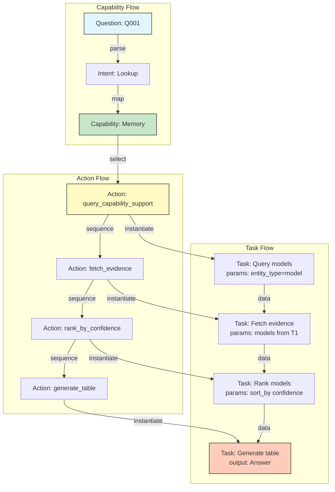
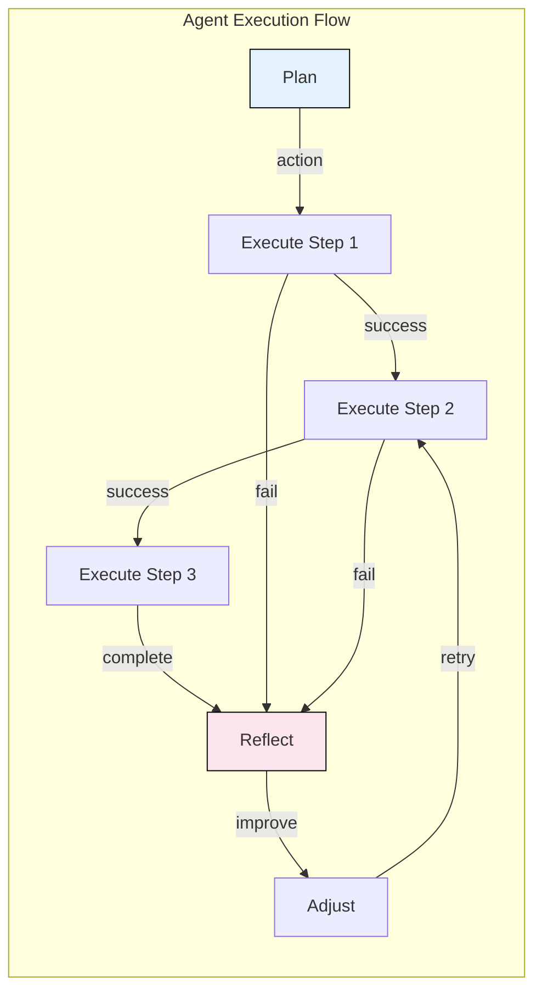
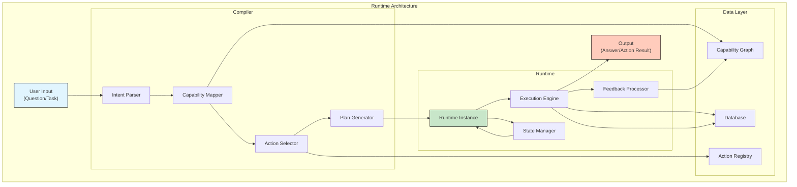

# AEP-0007: Capability Execution Layer

> 能力执行层
>
> 创建日期：2026-07-06

---

# 核心论点

> 从"认知系统"到"行动系统"
>
> 系统不仅要理解能力，还要能执行能力。当用户提问时，系统不只是"知道答案"，而是"执行一系列动作来生成答案"。本阶段建立从能力到行动的完整执行架构。

---

# 第一部分：Action Mapping System

## 1.1 能力→动作映射定义

### 核心概念

```yaml
概念:
  Capability = 能力的抽象定义（是什么）
  Action = 能力的具体执行单元（怎么做）
  
关系:
  Capability → 一组 Action Templates
  Action Template → 参数化执行流程
  
价值:
  1. 将抽象能力转化为可执行动作
  2. 允许系统真正"做事情"
  3. 实现从"知识"到"行动"的转变
```

### Action Template 结构

```yaml
Action Template:
  action_id: 唯一标识符
  action_name: 动作名称
  capability: 所属能力
  description: 动作描述
  input_schema: 输入参数规范
  output_schema: 输出结果规范
  prerequisites: 前置条件
  side_effects: 副作用（是否修改数据）
  execution_type: 执行类型（query/compute/generate/modify）
  complexity: 复杂度（low/medium/high）
```

## 1.2 核心 Capability 的 Action Registry

### Memory Capability

```yaml
Capability: memory.long-term.user
Type: Cognitive
Actions:

  Action 1: store_memory
    description: 存储用户信息到长期记忆
    input_schema:
      user_id: string (required)
      content: string (required)
      metadata: object (optional)
    output_schema:
      memory_id: string
      stored_at: timestamp
      success: boolean
    side_effects: modify (写入数据库)
    execution_type: modify
    
  Action 2: retrieve_memory
    description: 从长期记忆中检索信息
    input_schema:
      user_id: string (required)
      query: string (required)
      limit: integer (default=10)
      time_range: object (optional)
    output_schema:
      memories: array[{id, content, timestamp}]
      relevance_scores: array[float]
      total_count: integer
    side_effects: none (只读)
    execution_type: query
    
  Action 3: update_memory
    description: 更新已有记忆内容
    input_schema:
      memory_id: string (required)
      new_content: string (required)
      reason: string (optional)
    output_schema:
      updated_at: timestamp
      success: boolean
    side_effects: modify
    execution_type: modify
    
  Action 4: summarize_memory
    description: 对记忆内容进行摘要
    input_schema:
      user_id: string (required)
      time_range: object (optional)
      focus_area: string (optional)
    output_schema:
      summary: string
      key_points: array[string]
      coverage: float (0~1)
    side_effects: none
    execution_type: compute
```

### MCP Capability

```yaml
Capability: tool-use.mcp.client
Type: Protocol
Actions:

  Action 1: connect_mcp_server
    description: 连接到 MCP 服务器
    input_schema:
      server_url: string (required)
      server_name: string (optional)
      auth_token: string (optional)
    output_schema:
      connection_id: string
      available_tools: array[string]
      server_info: object
    side_effects: modify (建立连接)
    execution_type: query
    
  Action 2: discover_tools
    description: 发现服务器提供的工具
    input_schema:
      connection_id: string (required)
      tool_type: string (optional)
    output_schema:
      tools: array[{name, description, parameters}]
      total_count: integer
    side_effects: none
    execution_type: query
    
  Action 3: call_tool
    description: 调用 MCP 工具
    input_schema:
      connection_id: string (required)
      tool_name: string (required)
      parameters: object (required)
      timeout: integer (default=30000)
    output_schema:
      result: object
      execution_time: integer (ms)
      success: boolean
      error: string (if failed)
    side_effects: depends (工具可能修改外部系统)
    execution_type: compute
    
  Action 4: stream_context
    description: 流式传输上下文
    input_schema:
      connection_id: string (required)
      context_type: string (required)
      context_data: object (required)
    output_schema:
      stream_id: string
      status: string
    side_effects: modify
    execution_type: modify
```

### Agent Framework Capability

```yaml
Capability: agent.autonomous.execution
Type: System
Actions:

  Action 1: plan_task
    description: 规划任务执行步骤
    input_schema:
      goal: string (required)
      context: object (optional)
      constraints: array[string] (optional)
      max_steps: integer (default=10)
    output_schema:
      plan: array[{step_id, action, parameters}]
      estimated_time: integer
      confidence: float (0~1)
    side_effects: none
    execution_type: compute
    
  Action 2: execute_step
    description: 执行单个步骤
    input_schema:
      plan_id: string (required)
      step_id: string (required)
      parameters: object (required)
      retry_count: integer (default=3)
    output_schema:
      result: object
      success: boolean
      execution_time: integer (ms)
      next_step_hint: string (optional)
    side_effects: depends
    execution_type: compute
    
  Action 3: reflect_result
    description: 反思执行结果
    input_schema:
      execution_history: array[object] (required)
      goal: string (required)
      success_criteria: string (required)
    output_schema:
      reflection: string
      improvements: array[string]
      should_retry: boolean
    side_effects: none
    execution_type: compute
    
  Action 4: coordinate_agents
    description: 协调多个 Agent
    input_schema:
      agents: array[{id, role}] (required)
      task: object (required)
      coordination_strategy: string (default="parallel")
    output_schema:
      coordination_plan: object
      agent_assignments: array[object]
      estimated_completion: timestamp
    side_effects: none
    execution_type: compute
```

### Computer Use Capability

```yaml
Capability: tool-use.computer.desktop
Type: Execution
Actions:

  Action 1: capture_screen
    description: 截取屏幕画面
    input_schema:
      region: object (optional)
      quality: string (default="high")
    output_schema:
      image: base64
      timestamp: timestamp
      resolution: object
    side_effects: none
    execution_type: query
    
  Action 2: analyze_screen
    description: 分析屏幕内容
    input_schema:
      image: base64 (required)
      analysis_type: string (default="general")
      focus_elements: array[string] (optional)
    output_schema:
      elements: array[{type, position, content}]
      actionable_items: array[object]
      confidence: float (0~1)
    side_effects: none
    execution_type: compute
    
  Action 3: execute_action
    description: 执行界面操作
    input_schema:
      action_type: string (required) (click/type/scroll/drag)
      target: object (required)
      parameters: object (optional)
    output_schema:
      success: boolean
      before_image: base64
      after_image: base64 (optional)
      execution_time: integer (ms)
    side_effects: modify (修改计算机状态)
    execution_type: modify
    
  Action 4: verify_result
    description: 验证操作结果
    input_schema:
      expected_state: object (required)
      current_image: base64 (required)
      tolerance: float (default=0.9)
    output_schema:
      match_score: float (0~1)
      differences: array[string]
      success: boolean
    side_effects: none
    execution_type: compute
```

---

# 第二部分：Capability → Task Compiler

## 2.1 编译器定义

### 核心概念

```yaml
Task Compiler:
  输入: AIQ-100 中的问题 + 用户意图
  输出: Execution Plan（可执行的行动计划）
  
  过程:
    1. 解析问题意图
    2. 映射到相关 Capability
    3. 选择合适的 Action Templates
    4. 组合成 Execution Graph
    5. 参数化（注入具体参数）
    6. 输出可执行计划
```

## 2.2 编译器算法

### 输入解析

```yaml
Step 1: Intent Classification
  操作: 确定问题类型（Lookup/Comparison/Timeline/Summary/etc）
  参考: AAS（回答规范）中的回答类型
  
Step 2: Capability Mapping
  操作: 根据问题关键词映射到相关 Capability
  输出: Relevant Capabilities[]
  
Step 3: Action Selection
  操作: 根据意图选择合适的 Action Templates
  输出: Candidate Actions[]
  
Step 4: Action Sequencing
  操作: 组合多个 Action 形成执行流程
  输出: Execution Graph
  
Step 5: Parameter Injection
  操作: 根据问题注入具体参数
  输出: Execution Plan（可执行）
```

### Execution Plan Schema

```yaml
Execution Plan:
  plan_id: 唯一标识符
  question_id: 对应的 AIQ 问题 ID
  intent_type: 意图类型
  
  execution_graph:
    nodes: [{action_id, parameters, dependencies}]
    edges: [{from, to, condition}]
    entry_point: 第一个执行的 action
    exit_points: 结束点（可能有多个）
  
  expected_outputs: [{type, description}]
  estimated_time: 预估执行时间
  complexity: 执行复杂度
  required_capabilities: 需要的能力列表
```

## 2.3 AIQ 编译示例

### Q001: 哪些模型支持 MCP？

```yaml
Question: Q001 - 哪些模型支持长期记忆？

Intent Analysis:
  type: Lookup
  target: Models supporting Memory
  output_type: Table

Execution Plan:

  plan_id: plan-q001
  question_id: Q001
  
  execution_graph:
    nodes:
      - node_1:
          action: query_capability_support
          capability: memory.long-term.user
          parameters:
            entity_type: "model"
          output: supported_models[]
      
      - node_2:
          action: fetch_evidence
          parameters:
            models: from node_1.output
            capability: "memory.long-term.user"
          output: evidence_list[]
      
      - node_3:
          action: rank_by_confidence
          parameters:
            items: from node_2.output
            sort_by: "confidence"
          output: ranked_models[]
      
      - node_4:
          action: generate_table
          parameters:
            data: from node_3.output
            columns: ["Model", "Memory Type", "Since"]
          output: answer_table
  
    edges:
      - {from: node_1, to: node_2}
      - {from: node_2, to: node_3}
      - {from: node_3, to: node_4}
    
    entry_point: node_1
    exit_points: [node_4]
  
  estimated_time: 500ms
  complexity: low
```

### Q021: GPT-4 和 Claude 3.5 在能力上有什么差异？

```yaml
Question: Q021 - GPT-4 和 Claude 3.5 在能力上有什么差异？

Intent Analysis:
  type: Comparison
  target: Model capabilities comparison
  output_type: Comparison Table

Execution Plan:

  plan_id: plan-q021
  question_id: Q021
  
  execution_graph:
    nodes:
      - node_1:
          action: query_model_capabilities
          parameters:
            model_1: "GPT-4"
            model_2: "Claude 3.5 Sonnet"
          output: capabilities_map{}
      
      - node_2:
          action: compute_difference
          parameters:
            capabilities: from node_1.output
            diff_type: "both" (找出共同和差异)
          output: differences{}
      
      - node_3:
          action: rank_differences
          parameters:
            differences: from node_2.output
            rank_by: "impact_weight"
          output: ranked_diff[]
      
      - node_4:
          action: generate_comparison_table
          parameters:
            data: from node_3.output
            format: "AAS Comparison"
          output: comparison_table
      
      - node_5:
          action: generate_pros_cons
          parameters:
            comparison: from node_4.output
            model_1: "GPT-4"
            model_2: "Claude 3.5 Sonnet"
          output: analysis
  
    edges:
      - {from: node_1, to: node_2}
      - {from: node_2, to: node_3}
      - {from: node_3, to: node_4}
      - {from: node_4, to: node_5}
    
    entry_point: node_1
    exit_points: [node_5]
  
  estimated_time: 800ms
  complexity: medium
```

### Q041: 最近 90 天最热门的 AI 能力是什么？

```yaml
Question: Q041 - 最近 90 天最热门的 AI 能力是什么？

Intent Analysis:
  type: Trend
  target: Capability popularity trend
  output_type: Chart + Summary

Execution Plan:

  plan_id: plan-q041
  question_id: Q041
  
  execution_graph:
    nodes:
      - node_1:
          action: query_events_by_time
          parameters:
            time_range: "last_90_days"
            event_types: ["feature-added", "capability-added"]
          output: events[]
      
      - node_2:
          action: group_by_capability
          parameters:
            events: from node_1.output
            group_by: "capability"
          output: capability_counts{}
      
      - node_3:
          action: rank_by_frequency
          parameters:
            counts: from node_2.output
            top_n: 10
          output: top_capabilities[]
      
      - node_4:
          action: fetch_capability_details
          parameters:
            capabilities: from node_3.output
          output: enriched_capabilities[]
      
      - node_5:
          action: generate_trend_chart
          parameters:
            data: from node_4.output
            chart_type: "bar"
          output: chart
      
      - node_6:
          action: generate_summary
          parameters:
            data: from node_4.output
            format: "AAS Summary"
          output: summary
  
    edges:
      - {from: node_1, to: node_2}
      - {from: node_2, to: node_3}
      - {from: node_3, to: node_4}
      - {from: node_4, to: node_5}
      - {from: node_4, to: node_6}
    
    entry_point: node_1
    exit_points: [node_5, node_6]
  
  estimated_time: 1200ms
  complexity: medium
```

---

# 第三部分：Execution Graph

## 3.1 执行图结构

### 三层结构

```yaml
Layer 1: Capability Flow（能力流）
  定义: 从问题到能力的选择流程
  流程: Question → Intent → Capability Selection
  
Layer 2: Action Flow（动作流）
  定义: 从能力到动作的执行流程
  流程: Capability → Action Templates → Action Chain
  
Layer 3: Task Flow（任务流）
  定义: 从动作到具体任务的执行流程
  流程: Action → Parameters → Execution → Output
```

### Execution Graph Schema

```yaml
Execution Graph:
  graph_id: 唯一标识符
  
  layers:
    capability_flow:
      nodes: [{capability, selection_reason}]
      edges: [{from, to}]
    
    action_flow:
      nodes: [{action, capability, params_template}]
      edges: [{from, to, data_dependency}]
    
    task_flow:
      nodes: [{task_id, action, concrete_params, status}]
      edges: [{from, to, trigger_condition}]
  
  execution_state:
    current_layer: 当前执行层级
    current_node: 当前执行节点
    completed_nodes: 已完成节点
    pending_nodes: 待执行节点
    failed_nodes: 失败节点
  
  outputs: 执行结果
```

## 3.2 Execution Graph Mermaid 图

### 示例：Q001 执行图



### 示例：Agent 任务执行图



---

# 第四部分：Action Feedback Loop

## 4.1 反馈回路定义

### 核心流程

```yaml
Feedback Flow:
  Action Execution → Result → Evaluation → Fact Generation → Event → Graph Update

目的:
  1. 验证执行是否成功
  2. 收集执行产生的证据
  3. 更新知识图谱
  4. 修正能力状态
```

## 4.2 反馈类型

```yaml
Type 1: Success Feedback（成功反馈）
  触发: Action 成功完成
  输出: 新 Fact（执行成功的证据）
  影响: 提升相关 Truth Score
  
Type 2: Failure Feedback（失败反馈）
  触发: Action 执行失败
  输出: 新 Fact（失败证据）
  影响: 降低相关 Truth Score，触发漂移检测
  
Type 3: Discovery Feedback（发现反馈）
  触发: 执行中发现新信息
  输出: 新 Fact（发现的证据）
  影响: 可能创建新 Event 或更新现有 Event
  
Type 4: Quality Feedback（质量反馈）
  触发: 执行结果质量低于预期
  输出: 新 Fact（质量问题证据）
  影响: 触发能力退化检测
```

## 4.3 Feedback Processing

### 处理流程

```yaml
Step 1: Collect Result
  操作: 收集 Action 执行结果
  输出: Action Result
  
Step 2: Evaluate Result
  操作: 评估结果是否符合预期
  输出: Evaluation Result
  
Step 3: Generate Fact
  操作: 将评估结果转换为 Fact
  输出: Feedback Fact
  
Step 4: Cross-Validate
  操作: 与其他证据交叉验证
  输出: Verified Fact
  
Step 5: Update Graph
  操作: 更新知识图谱
  输出: Graph Update
  
Step 6: Trigger Self-Correction
  操作: 如果需要，触发自校正
  输出: Correction Action
```

### Feedback Fact Schema

```yaml
Feedback Fact:
  fact_id: 唯一标识符
  action_id: 对应的 Action ID
  type: success/failure/discovery/quality
  
  content:
    expected: 预期结果
    actual: 实际结果
    difference: 差异描述
  
  evaluation:
    success: boolean
    quality_score: float (0~1)
    significance: float (0~1)
  
  context:
    execution_time: integer (ms)
    retry_count: integer
    parameters_used: object
  
  detected_at: timestamp
  confidence: float (based on evidence strength)
```

---

# 第五部分：Capability Runtime Layer

## 5.1 Runtime 定义

### 核心概念

```yaml
Runtime:
  定义: 能力执行时的完整上下文环境
  
  组成:
    Capability: 要执行的能力
    Action: 具体动作
    Context: 执行上下文
    State: 当前状态
    Feedback: 反馈回路
```

### Runtime Schema

```yaml
Runtime Instance:
  instance_id: 唯一标识符
  capability: 执行的能力
  action: 执行的动作
  plan_id: 所属的执行计划
  
  context:
    user_intent: 用户意图
    environment: 执行环境（API/数据库/外部系统）
    constraints: 执行约束
    available_resources: 可用资源
  
  state:
    phase: planning/executing/completed/failed
    progress: float (0~1)
    current_step: 当前步骤
    elapsed_time: 已用时间
    retry_count: 重试次数
  
  execution:
    parameters: 执行参数
    intermediate_results: 中间结果
    final_result: 最终结果
  
  feedback:
    enabled: boolean
    feedback_facts: array[Fact]
    graph_updates: array[Update]
```

## 5.2 Runtime 生命周期

```yaml
Phase 1: Initialization
  操作: 初始化 Runtime
  检查: 能力是否可用、参数是否有效
  
Phase 2: Planning
  操作: 生成执行计划
  输出: Execution Graph
  
Phase 3: Execution
  操作: 按计划执行动作
  状态: 动态更新进度
  
Phase 4: Monitoring
  操作: 监控执行状态
  异常: 错误处理、重试
  
Phase 5: Completion
  操作: 执行完成
  输出: 最终结果
  
Phase 6: Feedback
  操作: 生成反馈
  输出: Fact / Graph Update
```

## 5.3 Runtime Architecture



---

# 第六部分：总结

## 6.1 成功标准验证

| 标准 | 状态 | 说明 |
|------|------|------|
| ✔ Action Mapping System | ✅ | 4个核心 Capability 的完整 Action Registry |
| ✔ Capability → Task Compiler | ✅ | 3个 AIQ 问题编译示例 + Execution Plan Schema |
| ✔ Execution Graph | ✅ | 三层结构 + Mermaid 图 |
| ✔ Action Feedback Loop | ✅ | 4种反馈类型 + 处理流程 |
| ✔ Capability Runtime Layer | ✅ | Runtime Schema + 生命周期 + 架构图 |

## 6.2 核心成果

### 成果 1: 从认知到行动

```
以前: 系统知道能力是什么
现在: 系统知道能力怎么执行
```

### 成果 2: 问题到执行计划

```
以前: 系统能回答问题
现在: 系统能把问题编译成可执行计划
```

### 成果 3: 执行产生反馈

```
以前: 系统是单向的
现在: 执行结果会反馈回系统，更新图谱
```

## 6.3 系统级意义

> **从 Intelligence System 到 Capability Operating System**

我们已经构建了一个完整的 AI 能力操作系统：
- ✅ 定义能力（AIS）
- ✅ 回答问题（AIQ）
- ✅ 连接能力（AKG）
- ✅ 模拟变化（Dynamics Engine）
- ✅ 校准现实（Feedback Loop）
- ✅ 执行行动（Execution Layer）

**这就是 AI Capability Operating System v1.0。**

---

## 完整系统架构总结

```
┌─────────────────────────────────────────────────────────────┐
│                  AI Capability Operating System              │
├─────────────────────────────────────────────────────────────┤
│ Layer 7: Execution Layer (AEP-0007)                         │
│   - Action Registry, Task Compiler, Runtime                 │
├─────────────────────────────────────────────────────────────┤
│ Layer 6: Feedback Loop (AEP-0006)                           │
│   - Reality Ingestion, Drift Detection, Self-Healing        │
├─────────────────────────────────────────────────────────────┤
│ Layer 5: Dynamics Engine (AEP-0005)                         │
│   - Change Propagation, Impact Engine, Forecasting          │
├─────────────────────────────────────────────────────────────┤
│ Layer 4: Relationship Graph (AEP-0004)                      │
│   - 5 Types, 8 Relations, Dependency Weights                │
├─────────────────────────────────────────────────────────────┤
│ Layer 3: Capability Validation (AEP-0002/0003)              │
│   - MCP/Memory/Computer Use/Agent Framework                 │
├─────────────────────────────────────────────────────────────┤
│ Layer 2: Question System (AIQL)                             │
│   - 100 Questions, Intent Classification                    │
├─────────────────────────────────────────────────────────────┤
│ Layer 1: Language System (AIS)                              │
│   - Dictionary, Ontology, Taxonomy, Scoring                 │
└─────────────────────────────────────────────────────────────┘
```

---

## 下一阶段入口（AEP-0008）

可以考虑的方向：

1. **实时执行引擎**：将 Runtime 接入实时系统
2. **多任务调度**：支持并行执行多个任务
3. **执行优化**：根据历史执行数据优化执行路径
4. **用户界面层**：为用户提供交互界面，真正让用户使用系统

---

*创建日期：2026-07-06*
*AEP-0007 状态：✅ 完成*